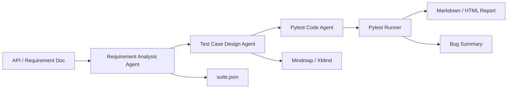

# AI Test Agent

AI Test Agent 是一个面向测试开发岗位的作品集项目：输入接口需求文档，系统自动分析测试点、生成测试用例、生成 `pytest` 代码、执行测试，并输出 Markdown/HTML 测试报告。

这个项目不是普通聊天机器人，而是把测试思维、自动化测试和 Agent 工作流结合起来，适合用于展示测试开发、AI 应用测试、初级 Agent 开发能力。当前版本额外支持疑似 Bug/风险摘要和测试脑图导出，更适合在面试中演示完整测试资产链路。

## Features

- 需求分析 Agent：从 Markdown/API 文档中提取接口、状态码、请求体、响应字段。
- 用例生成 Agent：自动生成正向、异常、边界相关测试用例。
- 代码生成 Agent：生成可运行的 `pytest` + `FastAPI TestClient` 测试代码。
- OpenAPI 导入：支持从 Swagger/OpenAPI JSON 自动提取接口契约。
- 执行分析：自动运行生成的测试，解析 JUnit XML 结果。
- 报告输出：生成 `suite.json`、`report.md`、`report.html`。
- Bug 摘要：执行失败时生成疑似 Bug；全部通过时生成高风险关注项。
- 测试脑图：导出 Mermaid Markdown 脑图和 `.xmind` 文件，串联接口、测试点、用例、风险和报告状态。
- 离线可运行：没有 API Key 时使用确定性规则引擎，保证 CI 和面试演示稳定。
- 可选 LLM：预留 OpenAI 兼容接口和 LangChain adapter。

## Architecture



## Quick Start

```bash
python -m pip install -e ".[dev]"
python -m ai_test_agent run --input examples/sample_api_requirements.md --output runs/demo
```

After running, open:

- `runs/demo/generated_tests/test_generated_api.py`
- `runs/demo/suite.json`
- `runs/demo/reports/report.md`
- `runs/demo/reports/report.html`
- `runs/demo/assets/bug_summary.json`
- `runs/demo/assets/test_mindmap.md`
- `runs/demo/assets/test_mindmap.xmind`

## Web UI

Start the FastAPI service:

```bash
python -m ai_test_agent serve --host 127.0.0.1 --port 8000
```

Open the browser UI:

```text
http://127.0.0.1:8000/
```

The Web UI can run Markdown requirements or OpenAPI JSON, display endpoints, generated test cases, Bug/risk summaries, test mindmaps, and preview the generated HTML report.

The interface uses a lightweight React + Babel browser runtime with React Bits-inspired pieces such as shiny title text, spotlight panels, and an interactive dot-field background. No Node build step is required.

## CLI Usage

Generate and execute tests:

```bash
ai-test-agent run -i examples/sample_api_requirements.md -o runs/demo
```

Generate from OpenAPI/Swagger JSON:

```bash
ai-test-agent run -i examples/sample_openapi.json -o runs/openapi --input-format openapi
```

Generate only, without execution:

```bash
ai-test-agent run -i examples/sample_api_requirements.md -o runs/demo --no-execute
```

Return JSON output:

```bash
ai-test-agent run -i examples/sample_api_requirements.md -o runs/demo --json
```

## FastAPI Usage

Start the service:

```bash
ai-test-agent serve --host 127.0.0.1 --port 8000
```

Useful endpoints:

- `GET /`
- `GET /health`
- `POST /analyze`
- `POST /generate`
- `POST /run`

Requests accept `input_format` with `auto`, `text`, or `openapi`.

Example request:

```bash
curl -X POST http://127.0.0.1:8000/run ^
  -H "Content-Type: application/json" ^
  -d "{\"text\":\"## GET /health\nSuccess: 200\nResponse Keys: status\"}"
```

## Optional LLM Mode

The default mode is deterministic and does not need an API key. To enable an OpenAI-compatible model:

```bash
copy .env.example .env
```

Then edit:

```env
AI_TEST_AGENT_USE_LLM=true
OPENAI_API_KEY=your_api_key
OPENAI_BASE_URL=https://api.openai.com/v1
OPENAI_MODEL=gpt-4o-mini
```

Install optional dependencies:

```bash
python -m pip install -e ".[llm]"
```

## Test

```bash
python -m pytest
```

The CI workflow in `.github/workflows/ci.yml` runs the same test suite on every push and pull request.

## Portfolio Highlights

这个项目可以在简历中这样描述：

> AI Test Agent：基于 Python/FastAPI/pytest 的接口测试智能助手，支持从 Markdown 需求文档或 OpenAPI/Swagger JSON 自动提取测试点、生成结构化测试用例、生成并执行 pytest 自动化脚本，最终输出 Markdown/HTML 测试报告、疑似 Bug/风险摘要和 XMind 测试脑图；项目包含 CLI、FastAPI 接口、中文 Web UI、GitHub Actions CI 和离线可运行的规则引擎。

建议简历关键词：

- Python
- FastAPI
- pytest
- API 自动化测试
- OpenAPI/Swagger
- 测试用例设计
- Bug/风险摘要
- XMind 测试脑图
- Agent 工作流
- LangChain/OpenAI-compatible LLM
- CI/CD

## Roadmap

- 支持 Postman Collection 导入。
- 增加 Bug 状态流转和指派人字段。
- 增加 Web UI 生成过程时间线。
- 增加模型输出质量评测和提示词回归测试。
- 对接真实 HTTP 服务，不只使用内置 sample API。
